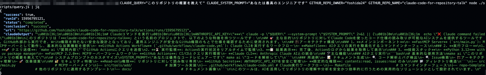

# claude-code-action-api
> ref. https://docs.anthropic.com/ja/docs/claude-code/sdk



# 何？
Claude Code Action のAPI版。GitHub Actions上で動作する。  
GitHub Repositoryのコードをコンテキストとして扱えて、かつGitHub以外のクライアントからもコールできるAIが欲しかったが、Claude Code Actionsがこれに対応していなかったので作った。  
用途としては、read権限のみに限った上で運用エンジニアがドキュメントを書いたり、仕様を起こすために使うことを想定している。  

### 何が嬉しいか
- Claude Code Actionはdispatchイベント非対応であり、GitHub上でチャットする必要がある。このプロジェクトを使うとRESTクライアントカラの実行が可能になるので、GitHub外部からもClaude Code Actionのような仕組みを実行できるようになる
- 権限をGitHub Actionsで制御するため、contentsやissueなどのリソース別にreadやwrite権限を与えることができ、安全に権限を設定できる
- Claude CodeではClaude Codeのホストマシンのみで処理が完結する。GitHub Actions以外のクラウドサービスを経由しないため機密性が高い
- GitHub Actionsだけで処理が完結しており、認証のセキュリティの固さはGitHubと同等

### 環境
- 動作環境
  - GitHub Actionsで動作
  - Node.js 22
- クライアント
  - [GitHub CLI](https://cli.github.com/)

# セットアップ
> ref. https://docs.anthropic.com/ja/docs/claude-code/sdk

一般のリポジトリに構成する場合の方法。読み取られるリポジトリと、読み取りを実行するJSクライアントで設定が必要。

**読み取られるリポジトリの設定**
- リポジトリのルートに `.github/workflows/claude-code.yaml` をコピーして配置。リポジトリごとに変更が必要な箇所はないが、Anthropic Claudeを前提とした作りになっているので、Vertex AIやBedrockのClaudeを使う場合は適当に工夫する。
- Claude から `ANTHROPIC_API_KEY` を取得しGitHub Secretに格納（こちらもVertex AIやBedrockなどを使う場合は適当に工夫）

**読み取りを実行するJSクライアント**
- JSを実行するターミナルで `gh` コマンドを使えるようにする
- `scripts/query.js` をコピーする
- （お好みで）Makefileのコマンドをコピーして設定しておくと何かと楽

## 実行の流れ

1. **🚀 クエリの送信**: GitHub Actionsにクエリを送信
2. **⏳ 実行監視**: Actionの実行状況をリアルタイムで監視
3. **📋 結果表示**: 完了後、Actionのログから結果を直接取得して表示

## 基本的な使用方法

**Make経由で使用する**
- `make ai "このリポジトリの概要を教えて"`
- 実行結果: `🎯 リポジトリに対してClaude Codeを使ったコード仕様の読み取りが可能なAIシステムを提供するツールです。...`

**JSを直接呼び出して使用する**  
- GitHub Actionsを実行 --> Polling --> 結果をjsonで返却

    ```sh
    # CLAUDE_SYSTEM_PROMPT は省略可
    CLAUDE_QUERY="このリポジトリの概要を教えて" CLAUDE_SYSTEM_PROMPT="あなたは最高のエンジニアです" GITHUB_REPO_OWNER="Yoshida24" GITHUB_REPO_NAME="claude-code-for-repository-talk" node ./scripts/query.js
    ```

- 実行結果

    ```json
    {
        "success": true,
        "runId": 15956795121,
        "status": "completed",
        "conclusion": "success",
        "url": "https://github.com/Yoshida24/claude-code-for-repository-talk/actions/runs/15956795121",
        "claudeOutput": "\u001b[36;1m\u001b[0m\n\u001b[36;1m# Claudeコマンドを実行\u001b[0m\n\u001b[36;1mANTHROPIC_API_KEY=\"***\" claude -p \"$QUERY\" --system-prompt \"$SYSTEM_PROMPT\" 2>&1 || {\u001b[0m\n\u001b[36;1m  echo \"❌ Claude command failed\"\u001b[0m\nこのリポジトリは「**claude-code-for-repository-talk**」という名前のプロジェクトで、以下のような特徴を持つツールです：\n\n## 🎯 主な目的\nリポジトリに対してClaude Codeを使ったコード仕様の読み取りが可能なAIシステムを提供するツールです。GitHub外部から実行でき、Write権限を持たない安全な設計となっており、運用エンジニアが安全なGitHub権限のもとで仕様を確認するために使用されます。\n\n## 🏗️ アーキテクチャ構成\n\n### 1. **メインコンポーネント**\n- **FastMCP Server** (`src/main.py`): MCPサーバーとして動作し、基本的な加算機能を提供\n- **GitHub Actions Workflow** (`.github/workflows/claude-code.yml`): Claude CLIを実行するワークフロー\n- **Makefile**: AIクエリの実行を簡素化するコマンドインターフェース\n\n### 2. **実行フロー**\n1. **🚀 クエリ送信**: `make ai \"質問内容\"`でGitHub Actionsにクエリを送信\n2. **⏳ 実行監視**: Actionの実行状況をリアルタイムで監視\n3. **📋 結果表示**: 完了後、Actionのログから結果を取得して表示\n\n### 3. **技術スタック**\n- **Python 3.12+** with uv package manager\n- **FastMCP 2.2.0**: MCPサーバーフレームワーク\n- **GitHub Actions**: CI/CDとクエリ実行環境\n- **Claude CLI**: Anthropic Claude AIとの統合\n\n## 🛠️ 主な機能\n\n### AIクエリ実行\n```bash\n# 基本的な使用方法\nmake ai \"このリポジトリの概要を教えて\"\n\n# システムプロンプトのカスタマイズ\nSYSTEM_PROMPT=\"あなたは優秀なコードレビュアーです\" make ai \"コードを解析して\"\n```\n\n### 用途例\n- 📝 ドキュメント生成\n- 🔍 コード解析とバグ検出\n- 🔍 Issue検索\n- 🏗️ アーキテクチャ理解\n- 🚀 改善提案\n\n## 🔐 セキュリティ特徴\n- **Read-only権限**: リポジトリに対して読み取り専用\n- **GitHub Secrets**: ANTHROPIC_API_KEYを安全に管理\n- **限定的な権限**: contents:read, issues:read のみ\n\n## 📁 ディレクトリ構造\n```\n├── src/main.py                    # MCPサーバーメイン\n├── src/tools/add/                 # 加算ツール実装\n├── .github/workflows/claude-code.yml # Claude実行ワークフロー\n├── Makefile                       # コマンドインターフェース\n├── repo-template/                 # 他のリポジトリに適用するテンプレート\n└── docs/                         # ドキュメント画像\n```\n\nこのツールは、AIを活用してリポジトリの理解や分析を安全かつ効率的に行うための実用的なソリューションとして設計されています。\n"
    }
    ```

## 便利な使用例

### リポジトリについてClaudeに質問

```bash
make ai "このリポジトリの概要を教えて"
```

### 複数のファイルについて質問

```sh
make ai "srcディレクトリ内のPythonファイルの役割を教えて"
```

### コードレビューアーとして動作させる

```bash
SYSTEM_PROMPT="あなたは優秀なコードレビュアーです。セキュリティとパフォーマンスの観点から分析してください" make ai "このコードの改善点を教えて"
```

### 技術文書作成者として動作させる
```
SYSTEM_PROMPT="あなたは技術文書の専門家です。わかりやすい説明を心がけて回答してください" make ai "このプロジェクトのアーキテクチャを説明して"
```

### 初心者向けの説明者として動作させる
```
SYSTEM_PROMPT="プログラミング初心者にもわかりやすく、具体例を交えて説明してください" make ai "このコードは何をしているの？"
```

### 📝 ドキュメント生成
```bash
make ai "このプロジェクトのREADMEを改善するための提案をして"
```

### 🔍 コード解析
```bash
make ai "バグの可能性がある箇所を特定して"
SYSTEM_PROMPT="セキュリティ専門家として" make ai "脆弱性はありますか？"
```

### 🏗️ アーキテクチャ理解
```bash
make ai "このプロジェクトの全体的な構造と各ファイルの役割を教えて"
```

### 🚀 改善提案
```bash
SYSTEM_PROMPT="パフォーマンス最適化の専門家として" make ai "コードの最適化ポイントを教えて"
```

## 注意事項

- 実行にはGitHub Actionsの実行時間が消費されます
- Claude APIの利用料金が発生します
- 大きなリポジトリの場合、実行に時間がかかる場合があります

## 追加したい機能
- Issueが確認できないので確認できるようにしたい
- MCPサーバーを入れたい
